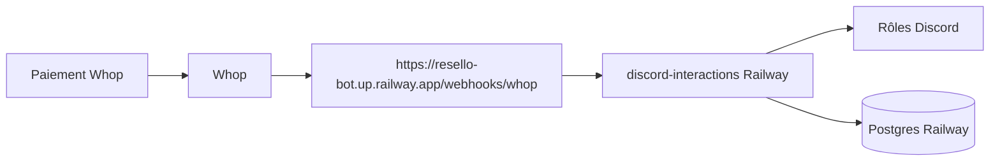

# URL Whop fixe via Railway

## Railway vs VPS (en bref)

| | Railway | VPS |
|--|---------|-----|
| Setup | Git push, URL HTTPS auto | Serveur à installer (SSH, nginx, systemd) |
| URL fixe | Oui (`xxx.up.railway.app` ou domaine) | Oui (avec domaine) |
| Plusieurs projets | Oui — Vintify + Resello = 2 services/projets | Oui — plusieurs apps sur la même machine |
| Maintenance | Railway gère l’infra | Tu gères OS, updates, crashes |
| Prix | Inclus dans ton abo (selon usage RAM/CPU) | ~5 €/mois fixe |

**Oui : avec ton abo Railway tu peux faire tourner 2 projets** (Vintify + bot Resello). Ce sont deux services séparés, chacun avec son URL et ses variables d’env.

**Choix retenu : Railway** — tu l’as déjà, URL HTTPS fixe, pas de tunnel temporaire.



## Ce qu’on déploie

Service Railway dédié qui lance :

```bash
uv run vinted-bot discord-interactions
```

Ce process démarre déjà le serveur webhook Whop sur `WHOP_WEBHOOK_PORT` ([gateway.py](src/vinted_bot/interactions/gateway.py) + [whop_webhooks.py](src/vinted_bot/services/whop_webhooks.py)).

**Hors scope immédiat :** `scrape --loop` / Playwright (plus lourd ; peut rester en local ou un 2e service plus tard). L’attribution des rôles après paiement ne dépend que de `discord-interactions` + DB.

## Fichiers à ajouter

- `Dockerfile` (ou config Nixpacks) : Python 3.12, deps, CMD `discord-interactions`
- `railway.toml` : start command + healthcheck `GET /webhooks/whop/health`
- `.env.example` : rappeler `PORT` / `WHOP_WEBHOOK_PORT` (Railway injecte souvent `PORT`)

Adapter le code pour que le webhook écoute `PORT` Railway si présent, sinon `WHOP_WEBHOOK_PORT` (déjà 8788) — petite modif dans [config.py](src/vinted_bot/config.py) / `start_whop_webhook_server`.

## Config Railway (à faire une fois)

1. Nouveau projet **Resello Bot** (à côté de Vintify)
2. Plug-in **Postgres** → `DATABASE_URL`
3. Variables d’env (copier depuis ton `.env` local) :
   - `DISCORD_BOT_TOKEN`, `DISCORD_GUILD_ID`
   - `DISCORD_ROLE_SUB_STARTER/PRO/PROPLUS`
   - `WHOP_WEBHOOK_SECRET`, `WHOP_PRODUCT_*`
   - rôles / guild IDs nécessaires
4. Generate Domain → URL fixe
5. Whop → Webhooks → URL **définitive** :
   `https://TON-SERVICE.up.railway.app/webhooks/whop`
6. Events : `membership_activated`, `membership_deactivated`
7. Migration Alembic au deploy (`alembic upgrade head`)

## Après deploy

- Plus de cloudflared / ngrok
- Chaque nouvel abonné → webhook → rôles auto
- Tester avec un paiement / Send test Whop
- Vérifier logs Railway : `whop_webhook_handled` / `whop_roles_synced`

## Limite à connaître

Le Mac peut rester pour le scrape local ; les **rôles Whop** seront gérés 24/7 par Railway. Si tu veux tout (scrape + bot) sur Railway plus tard, on ajoutera un 2e service.

## Statut implémentation (2026-08-06)

- `Dockerfile` + `scripts/railway-entrypoint.sh` (`APP_ROLE=api`)
- `docs/RAILWAY_WHOP.md` + `docs/RAILWAY_SERVICES.md`
- `config.py` : `PORT` Railway prioritaire pour webhook
- Prod : service `bot-vented` sur Railway (`reliable-healing`)
